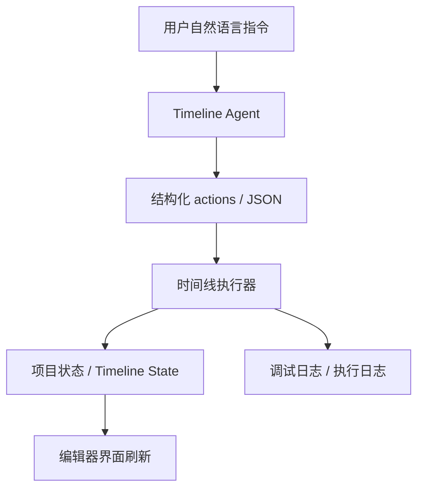

# 剪艾 JianAI

剪艾 JianAI 是一个面向桌面端的 AI 剪辑项目。当前阶段的核心目标不是“文生视频”，而是让用户通过自然语言直接修改时间线，实现更高效的素材编排、片段移动、裁剪、转场和标题编辑。

现阶段我们把产品重点收敛在：

- AI 对话式剪辑
- 时间线 JSON 状态驱动
- 本地桌面编辑器体验
- 可持续扩展的 Agent 执行框架

图像生成、视频生成这类能力暂时不作为当前主线功能，后续会在开发计划中逐步恢复。

> **当前定位**
> 剪艾不是一个“先生成、后编辑”的演示壳子，而是一个“AI 直接参与剪辑”的桌面编辑器原型。

<p align="center">
  
</p>

<p align="center">
  
</p>

## 当前亮点

### 1. AI 对话式剪辑

右侧 `Timeline Agent` 可以读取当前时间线状态，把自然语言转换成结构化编辑动作，再真正修改剪辑数据，而不是只返回建议文本。

当前已经支持的典型操作包括：

- 选中指定片段
- 将片段前移 / 后移
- 调整时长
- 修改速度
- 添加淡入 / 淡出
- 删除片段
- 复制片段
- 添加标题

### 2. 时间线由结构化状态驱动

项目内部不是“脚本胡乱点 UI”，而是通过时间线数据模型驱动界面变化。也就是说：

- AI 先生成 `actions`
- 执行器应用到时间线状态
- React UI 自动刷新

这种方式更适合做：

- 可回放的编辑记录
- 可调试的执行日志
- 未来的撤销 / 重做 / patch 预览
- 更稳定的 Agent 自动化剪辑

### 3. 已接入真实 AI 推理链路

当前 Agent 已支持接 OpenAI-compatible 接口，把模型返回约束成结构化 JSON，再落到本地时间线执行器。

### 4. 已内置调试链路

为了排查“AI 有回复但时间线没变化”这类问题，项目里已经补了调试版能力：

- Agent 面板内调试日志
- Renderer 控制台日志
- 持久化 `jsonl` 调试日志

这对后续继续做 Agent 稳定性和可解释性很关键。

## 当前暂不主推的能力

下面这些功能目前不是本项目的主线卖点，部分能力会被弱化、关闭，或者放到后续开发计划：

- 文生视频
- 图生视频
- 音频生视频
- 图像生成
- 重生成 / Retake
- 本地大模型推理工作流

原因很直接：当前产品最有差异化的地方不是“又一个生成器”，而是“AI 真正参与剪辑操作”。

## 适合谁

剪艾当前更适合以下几类用户：

- 想验证 AI 剪辑交互形态的产品团队
- 需要做时间线 Agent 的开发者
- 想把自然语言命令接入剪辑器的技术团队
- 需要桌面端原型，而不是纯 Web demo 的团队

## 当前项目状态

### 已可用

- 桌面端视频编辑器界面
- 多轨时间线基础编辑
- AI 对话面板
- 结构化 Agent action 执行
- 调试日志查看
- 无本地 Python 首启下载的桌面壳构建

### 正在完善

- 品牌替换与中文化
- Agent 指令覆盖面
- 更可靠的多轮上下文理解
- 更清晰的执行反馈

### 暂未完成

- 完整的安装器发布链
- 完整的前端测试体系
- 面向最终用户的产品化打磨

## 开发路线图

### 近期

- 继续强化 AI 剪辑命令覆盖率
- 增加更明确的执行预览与变更说明
- 支持更稳定的片段引用和多轮对话
- 提升日志可读性和错误定位效率

### 中期

- 支持字幕、轨道、批量操作
- 支持“先预览 patch，再确认执行”
- 支持更强的撤销 / 重做整合
- 优化品牌、界面和交互一致性

### 后期

- 重新开放图像生成与视频生成能力
- 统一生成与剪辑工作流
- 形成 AI 生成 + AI 剪辑 + 手动编辑的一体化产品

## 技术架构

项目仍然保留三层结构：

- `frontend/`：React + TypeScript 编辑器界面
- `electron/`：Electron 主进程、IPC、文件系统与打包能力
- `backend/`：Python / FastAPI 能力层

但当前产品方向上，最核心的是前端时间线编辑器和 Agent 执行链路。



## 运行与开发

### 环境要求

- Node.js
- pnpm
- `uv`
- Git

### 安装依赖

```bash
pnpm install
```

### 开发模式

```bash
pnpm dev
```

### 调试模式

```bash
pnpm dev:debug
```

### 类型检查

```bash
pnpm typecheck
```

### 后端测试

```bash
pnpm backend:test
```

## 桌面构建

如果你只想构建桌面壳，不希望首启下载本地 Python 环境，可以使用当前项目里的“禁用本地后端”方案。

编译产物默认不会进入 Git：

- `dist/`
- `dist-electron/`
- `release/`

## 数据与日志

应用数据默认保存在：

- Windows：`%LOCALAPPDATA%\JianAI\`
- macOS：`~/Library/Application Support/JianAI/`
- Linux：`$XDG_DATA_HOME/JianAI/`

日志会写入应用数据目录下的日志文件夹。

## 文档

- [docs/INSTALLER.md](docs/INSTALLER.md)：安装包构建
- [docs/TELEMETRY.md](docs/TELEMETRY.md)：匿名统计说明
- [backend/architecture.md](backend/architecture.md)：后端架构

## 开源说明

本仓库当前是基于现有桌面视频生成项目的二次开发版本，已经开始转向“AI 剪辑”主线。

因此你会在部分代码和底层依赖中继续看到：

- `LTX`
- `LTX API`
- `LTX-2`

这些名称目前主要代表底层模型或既有依赖，不等于当前产品品牌。

## License

Apache-2.0，见 [LICENSE.txt](LICENSE.txt)。

第三方依赖与模型相关条款见 [NOTICES.md](NOTICES.md)。
