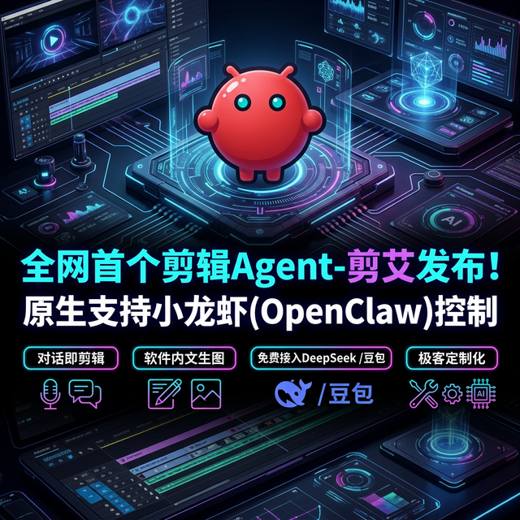

# 剪艾 JianAI —— 全网首个桌面剪辑 Agent

  

剪艾 JianAI 是一个面向桌面端的 **AI 原生视频剪辑应用**。区别于传统的“生成式 AI”玩具，剪艾的核心卖点是**“AI 真正参与剪辑操作”**。它将大语言模型（LLM）的推理能力直接接入视频时间线的底层逻辑，让用户通过**自然语言聊天**就能实现精准的素材编排、片段移动、裁剪、转场和标题编辑。

---

## 🚀 核心超能力 (Superpowers)

### 1. 对话即剪辑 (Chat-based Editing)
右侧内置的 `Timeline Agent` 不只是个聊天窗口。它能实时读取当前时间线状态，并将你的自然语言指令（如“把选中的片段往后挪2秒”、“在5秒处加个标题”）转换成**结构化的剪辑动作**。通过数据驱动界面（React UI）刷新，实现毫秒级的精准执行。

### 2. 原生支持小龙虾 (OpenClaw Control)
全网首个深度适配 **OpenClaw (小龙虾)** 操控协议的剪辑软件。开放本地 HTTP 端口（47821），支持外部 Agent 或 Python 脚本远程驱动剪辑项目。真正实现了“Agent 操纵 Agent”的工业级自动化流。

### 3. 软件内直出文生图 (In-app AI Generation)
创作缺素材？不用跳出软件！「剪艾」内置了 AI 图像生成模块。只需在软件内输入提示词，生成的精美图片将直接进入素材库，生成的瞬间即可拖入时间线，打造极致的闭环创作心流。

### 4. 免费接入顶级大模型 (Double Top LLMs)
零成本白嫖最强算力！完美适配以 **DeepSeek** 和 **豆包 (Doubao)** 为代表的 OpenAI 兼容接口。只要你有 API Key，顶级 AI 马上化身为你的 24 小时后期助理。

### 5. 极客定制化 (Geek & Customizable)
基于 **Electron + React + Python (FastAPI)** 的三层架构打造。底层逻辑全透明，支持开发者根据业务需求定制垂直领域的剪辑逻辑，是打造自动化剪辑工作流的最佳原型。

---

## 📦 下载与使用

### 下载安装
你可以通过以下方式获取桌面客户端：
*   **夸克网盘 (推荐，国内下载快)**：[点击进入下载页面](https://pan.quark.cn/s/d42e266a2640)
*   **GitHub Releases**：[点击前往 Release 页面](https://github.com/luoluoluo22/JianAI/releases)

**Release 包含：** Windows 免安装便携版 (`win-unpacked.zip`)。
**运行步骤：** 解压 -> 找到 `剪艾 JianAI.exe` -> 双击启动。

### 快速开始
1.  **导入素材**：将你的图片、视频、音频拖入左侧素材区。
2.  **配置 AI**：点击 Agent 面板右上角的“设置”，填入你的 OpenAI 兼容 API（如 DeepSeek 或 豆包的地址、模型名和 Key）。
3.  **开始聊天**：在右侧控制台尝试输入：“把第一张图片放到5秒位置”。

---

## 🛠️ 技术架构

项目采用**三层解耦结构**，确保了强大的 UI 表现力与复杂的逻辑处理能力：

*   **前端 (Frontend)**: React 18 + TypeScript + Tailwind CSS。负责编辑器渲染与 Agent 对话交互。
*   **应用壳 (Electron)**: 管理应用生命周期、IPC 通信、以及 Python 后端进程的调度。
*   **后端 (Backend)**: Python 3.12 + FastAPI。负责处理 LLM 映射逻辑、管理时间线状态锁以及执行复杂的文件处理动作。

---

## 📖 开发者文档

- **[CLAUDE.md](CLAUDE.md)** — 开发规范与详细架构
- **[AGENTS.md](AGENTS.md)** — Timeline Agent 动作协议定义与扩展指南
- **[backend/architecture.md](backend/architecture.md)** — 后端核心逻辑分析
- **[skills/](skills/)** — 包含 OpenClaw 操控在内的典型技能包定义

---

## ⏳ 未来路线图 (Roadmap)
- [ ] **语义化搜索**：通过自然语言搜索素材库。
- [ ] **可视化补丁预览 (Patch Preview)**：执行前先看 AI 改动后的虚影，确认后再应用。
- [ ] **自动化混剪**：一键让 Agent 根据脚本大纲自动完成初剪。
- [ ] **生态开放**：支持插件式扩展，开发者可上传自己的“剪辑技能”。

---

## 🤝 致谢与声明

本项目的底层编辑器架构及部分多媒体处理能力衍生自开源项目 [Lightricks/LTX-Desktop](https://github.com/Lightricks/LTX-Desktop)。感谢 Lightricks 团队在 AI 视频工具领域的杰出贡献。

**剪艾 JianAI** 在此基础上进行了深度的二次开发与重构，当前的核心研究方向在于：
*   **Timeline Agent**：将模糊的自然语言指令精准映射为结构化时间线动作。
*   **OpenClaw 集成**：通过本地控制协议实现外部 Agent 对专业编辑器的自动化驱动。

## 开源说明
本仓库由 [luoluoluo22](https://github.com/luoluoluo22) 维护。欢迎提交 PR 和 Issue，我们共同探索 AI 剪辑的无限可能。

**License:** Apache-2.0. 见 [LICENSE.txt](LICENSE.txt)。
